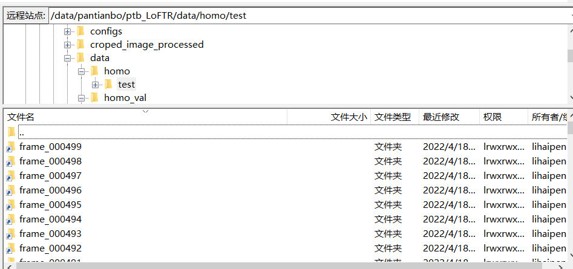

# LoFTR-MedicalData
Compare to the author's original work： [LoFTR](https://github.com/zju3dv/LoFTR#readme)  
Use the 'create_homo_data/Process_data.py' to process each frame to get the folder 'xx_processed'
After adding soft links:
  
